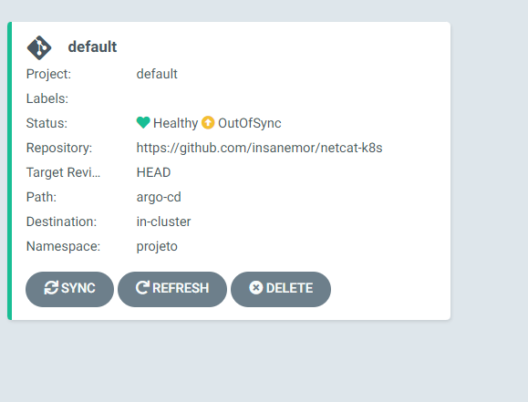

# netcat-k8s

This project is a Technical Challenge to test knowledge in Kubernetes e GitOps.

<details><summary> Summary </summary>

- [Objective](#objective)
  - [Challenge Description](#challenge-description)
  - [Delivery](#delivery)
  - [Observations](#observations)
- [Journey](#journey)
  - [K8s Cluster Configuration](#k8s-cluster-configuration)
  - [Installing Argo-Cd for Continuous Deployment](#installing-argo-cd-for-continuous-deployment)
  - [Building the solution and making the Docker Image](#building-the-solution-and-making-the-docker-image)
  - [Building a Helm Template](#building-a-helm-template)
  - [Making the Argo Application](#making-the-argo-application)
  - [Usage](#usage)

</details>

## Objective

### Challenge Description

Neste ambiente você terá que montar uma solução em código kubernetes e shell script para contemplar o seguinte cenário:

O netcat é um utilitário de rede amplamente utilizado por administradores, esta ferramenta deverá ser usada com a função de simular uma aplicação que contenha diversas portas TCP e UDP que podem ser levantadas a partir de um arquivo de configuração localizado no Git.

Neste desafio você deverá elaborar um manifesto kubernetes para fazer o deployment de um container de próprio build que rode o netcat em portas especificas passadas através de argumentos de inicialização pelo arquivo de configuração, portas estas que podem ficar ao seu critério.

A necessidade do negócio é que essa aplicação netcat receba essas definições dos argumentos de inicialização em um arquivo de configuração no Git, e que quando os mantenedores realizarem um commit no arquivo de configuração adicionando uma nova porta seja iniciado uma ação automática de update do container contendo as novas portas incluídas no arquivo de configuração.

Nesta solução as portas abertas pelo netcat deverão estar disponíveis para o mundo externo, e isso deve ser feito de maneira orquestrada, logo cada novo commit do arquivo de configuração no Git deve contemplar um manifesto kubernetes que exponha a porta do container e do service para o mundo externo ao kubernetes.

### Delivery

- Ambiente de kubernetes rodando na Virtual Machine com três nodes, pode ser usado minikube, k3sup e outros;
- Build de Imagem docker contendo o netcat e seu respectivo Dockerfile no docker hub ou outro registry;
- Manifesto kubernetes para o deployment do netcat e exposição do serviço para o mundo externo - internet, pode ser feito através de nodeport ou port forwarding;
- Script parametrizável para o container de netcat abrir mais de uma porta essas definições devem ser lidas de um config;
- Pipeline, GitSync, SideCar ou qualquer outra forma para deployment continuo quando inserida nova porta no arquivo de parametrização (config) de portas listening que o container do netcat ler dever ser atualizado os manifestos kubernetes e - aplicado a alteração no cluster;
- Essas entregas acima deverão estar descritas em um README no seu Git;

### Observations

- Netcat será usado como listener em portas TCP e ou UDP;
- Pode ser usado o Git da sua preferência - GitLab, GitHub, Bitbucket;
- Pode ser usado CI/CD, GitSync, Side car, GitOps para compor a solução;
- Deve-se permitir que as portas do netcat sejam definidas no arquivo de configuração e deverão refletir no manifesto kubernetes para o container port e service , pode ser usado script, helm ou qualquer outra forma para fazer essa integração / atualização;
- Deve ser um processo automatizado que tenha um fluxo do início ao fim de forma concisa e atenta para estratégias de upgrade;

## Journey

### K8s Cluster Configuration

Along with the challenge description, it was given an IP and a password to make SSH access.
I registered a new SSH key on this machine and executed k3sup to provide the kubernetes cluster:

```bash
export IP="143.198.239.9"
k3sup install --ip "143.198.239.9" --user root --ssh-key  ~/.ssh/tech_challenge_key
```

k3sup provided a cluster and it could be reached by Kubeconfig.


With kubeconfig file, I set up Lens basically to give support in cluster operations while GitOps was not yet installed.


### Installing Argo-Cd for Continuous Deployment

Argo CD was the tool chosen for GitOps and was installed by running the two following commands:

```bash
kubectl create namespace argocd

kubectl apply -n argocd -f https://raw.githubusercontent.com/argoproj/argo-cd/stable/manifests/install.yaml
```

After command, Argo was accessible by forwarding its port 8080 to a local port through Lens.


With Argo up and running, we registered the application related to this project, as can be seen in screenshot below:



- validado com um aplication de metrix-server .... .

### Building the solution and making the Docker Image

With Environment and GitOps working, the script was designed according to the objectives of the challenge. Here is the [source code](netcat-app/script/multiport-netcat.sh).

The script reads the `ports.ini` in local filesystem and create a netcat process for each port in the file.

After the script was finished, the Dockerfile for building the image was made. Here is the [source code](netcat-app/dockerfile).

The image was build with command `docker build -t insanemor/netcat .` and pushed into [Dockerhub Registry](https://hub.docker.com/r/insanemor/netcat).

### Building a Helm Template

The templates were build after the script was made. The [Values.yaml](charts/values.yaml) is simple, it only has fields to configure the app name, image tag and the ports that should be bound to the netcat processes.

Those values are referenced by the templates. Besides the [Deployment template](charts/netcat/templates/deployment.yaml), it was necessary to create a [Service template](charts/netcat/templates/services.yaml) to expose the ports and a [ConfigMap](charts/netcat/templates/configmap.yaml) to provide the ports as a file inside the pod filesystem.

### Making the Argo Application

In order to make GitOps work, an [Application Resource](argo-cd/netcat.yaml) was made. This application points its source repository URL to this repository, detecting changes in code and applying updates in the Cluster.

### Usage

Simply edit `values.yaml` with the ports that should be listening in the netcat pod and commit the changes. Argo-CD will automatically apply the changes.

In case of change in the script or Dockerfile, the Docker Image must be updated and it can be done by running `docker build -t insanemor/netcat .`.
As a tech debt, some form of CI/CD pipeline could be added to the repository to detect changes in the `netcat-app` folder and run `Docker build` and `Docker push` commands.
