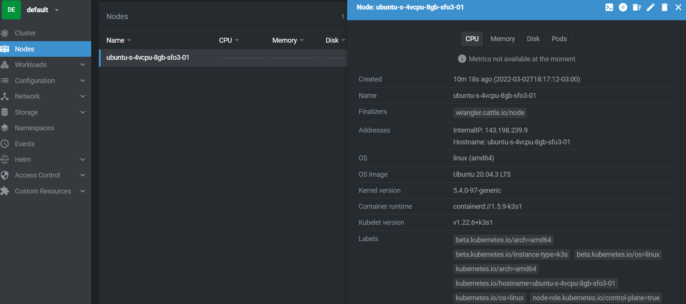

# netcat-k8s

# Objetivo 

Neste ambiente você terá que montar uma solução em código kubernetes e shell script para contemplar o seguinte cenário:

O netcat é um utilitário de rede amplamente utilizado por administradores, esta ferramenta deverá ser usada com a função de simular uma aplicação que contenha diversas portas TCP e UDP que podem ser levantadas a partir de um arquivo de configuração localizado no Git.

Neste desafio você deverá elaborar um manifesto kubernetes para fazer o deployment de um container de próprio build que rode o netcat em portas especificas passadas através de argumentos de inicialização pelo arquivo de configuração, portas estas que podem ficar ao seu critério.

A necessidade do negócio é que essa aplicação netcat receba essas definições dos argumentos de inicialização em um arquivo de configuração no Git, e que quando os mantenedores realizarem um commit no arquivo de configuração adicionando uma nova porta seja iniciado uma ação automática de update do container contendo as novas portas incluídas no arquivo de configuração.

Nesta solução as portas abertas pelo netcat deverão estar disponíveis para o mundo externo, e isso deve ser feito de maneira orquestrada, logo cada novo commit do arquivo de configuração no Git deve contemplar um manifesto kubernetes que exponha a porta do container e do service para o mundo externo ao kubernetes.

# Entrega 

- Ambiente de kubernetes rodando na Virtual Machine com três nodes, pode ser usado minikube, k3sup e outros;
- Build de Imagem docker contendo o netcat e seu respectivo Dockerfile no docker hub ou outro registry;
- Manifesto kubernetes para o deployment do netcat e exposição do serviço para o mundo externo - internet, pode ser feito através de nodeport ou port forwarding;
- Script parametrizável para o container de netcat abrir mais de uma porta essas definições devem ser lidas de um config;
- Pipeline, GitSync, SideCar ou qualquer outra forma para deployment continuo quando inserida nova porta no arquivo de parametrização (config) de portas listening que o container do netcat ler dever ser atualizado os manifestos kubernetes e - aplicado a alteração no cluster;
- Essas entregas acima deverão estar descritas em um README no seu Git;

# Observações: 

- Netcat será usado como listener em portas TCP e ou UDP;
- Pode ser usado o Git da sua preferência - GitLab, GitHub, Bitbucket;
- Pode ser usado CI/CD, GitSync, Side car, GitOps para compor a solução;
- Deve-se permitir que as portas do netcat sejam definidas no arquivo de configuração e deverão refletir no manifesto kubernetes para o container port e service , pode ser usado script, helm ou qualquer outra forma para fazer essa integração / atualização;
- Deve ser um processo automatizado que tenha um fluxo do início ao fim de forma conciza e antenta-so para estratégias de upgrade;

# Jornada 

Utilizado para prover o ambiente uma mauquina linux ... 

'''
export IP=143.198.239.9
k3sup install --ip 143.198.239.9 --user root --ssh-key  ~/.ssh/chave_desafio_tecnico
'''

Usando o k3sup 

Login lens 

# Instalado Argo-Cd para deploy contino 

- comandos no readme do argocd 

- Criado uma aplicacao para ler o repo de yaml do argo-cd 

- validado com um aplication de metrix-server .... .

# Criando um docker file para criar a imagem do netcat 
